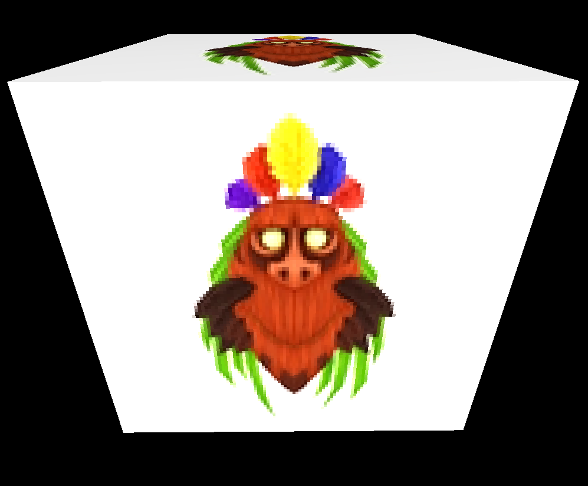
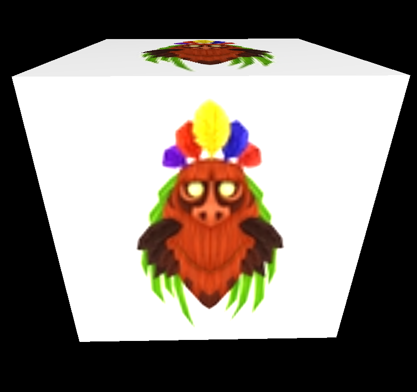

<h1 align = "center"> Atividade Prática 4 - Mapeamento e Filtragem de Texturas </h1>

<h3 align="center"> João Victor Rodrigues Galvão - 20190172620</h3>
<h3 align="center"> Yvson Nunes Figueiredo - 20190019716</h3>

## Introdução
O Trabalho desenvolvido aqui teve como objetivo realizar uma comparação entre os filtros de texturas estudados em sala e as suas respectivas utilidades em situações de magnificação e minificação. Para Tal, os filtros oferecidos pela biblioteca do threeJS (**NearestFilter**, **LinearFilter**, **NearestMipmapNearestFilter**, **NearestMipmapLinearFilter**, **NearestFilter**, **LinearMipmapNearestFilter** e **LinearMipmapLinearFilter**) foram utilizados.

<h2>Fenômeno de Magnificação</h2>

Em primeiro plano, para a análise da Magnificação, foi utilizada uma imagem de dimensões 125x107 **texels**.  A figura 1 ilustra um cubo o qual foi aplicado o filtro **Nearest neighbor** e, por tal razão, temos um resultado bastante pixelado, fruto da magnificação causada pela baixa resolução.

<h3 align = "center">Nearest neighbor</h3>

 

<b> Figura 1: Aku Aku (Game: Crash Bandicoot)  - magFilter: NearestFilter</b>

Por outro lado, A figura 2 ilustra o mesmo cubo com a filtragem sendo a Bilinear. Percebe-se que o "pixelamento" diminuiu bastante, contudo o resultado final gerou uma textura mais borrada.

<h3 align = "center">Bilinear</h3>

 

<b> Figura 2: Aku Aku (Game: Crash Bandicoot) - magFilter: LinearFilter</b>

<h2>Fenômeno de Minificação</h2>

## Referências

https://sbcode.net/threejs/mipmaps

https://threejsfundamentals.org/threejs/lessons/threejs-textures.html#loading